# MediGenie
 This platform utilizes a robust machine learning model trained on a vast dataset of symptoms and diseases. By inputting your symptoms, my system generates accurate predictions about potential illnesses, allowing you to make informed decisions about your health.

 # Working of Project

## Running the main.py file
We can either run the file using the menu or run it using the cmd command 'python run main.py'.
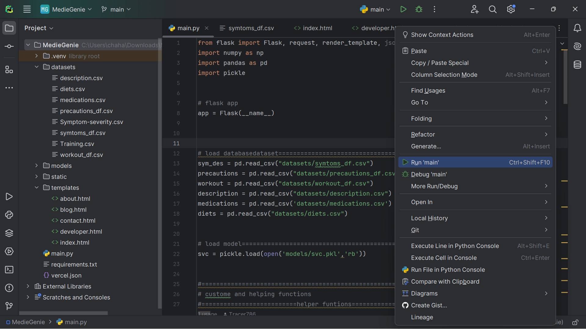

## Running the local web server
A local web server address would be generated to run our application.
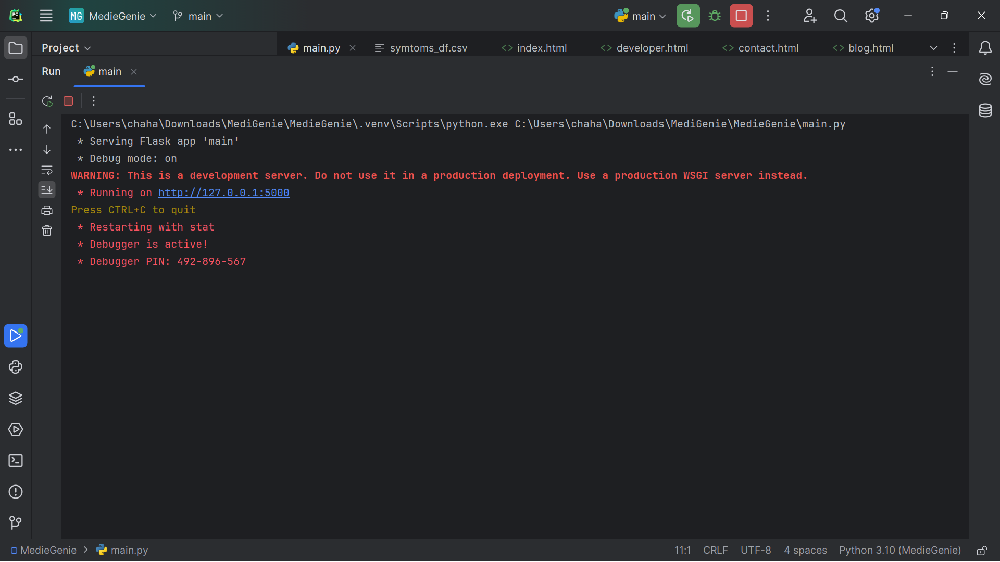

## Input Symptoms
Now we need to input the symptoms in the dialog box. We can do so by directly inputting the symptoms or by audio input(speech recognition).
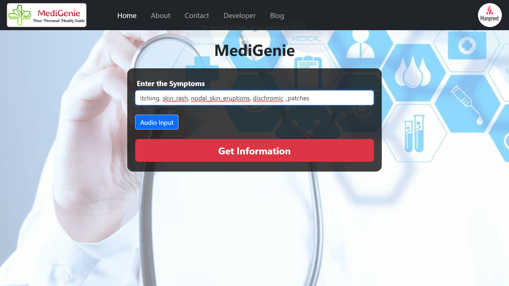

## Running prediction model
We can run the prediction model by clicking on the 'Get Information' Button. It will predict the disease and the other relevant data using the Machine Learning Model. Here we are using SVM (Support Vector Machine).
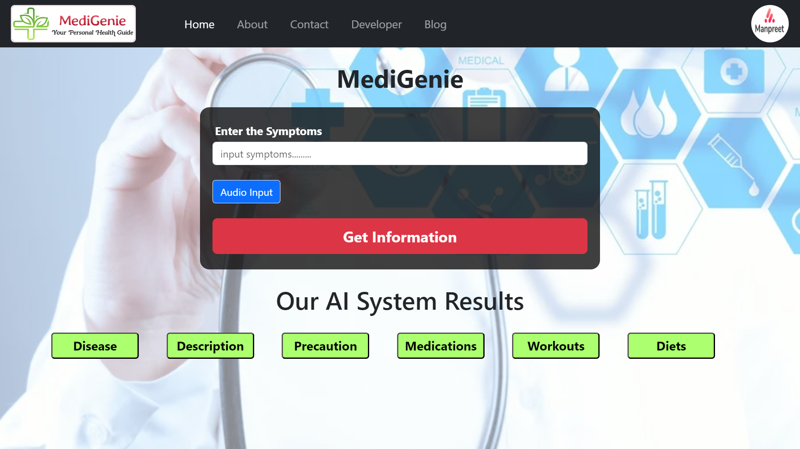

## Disease Information
### Predicted Disease

### Description
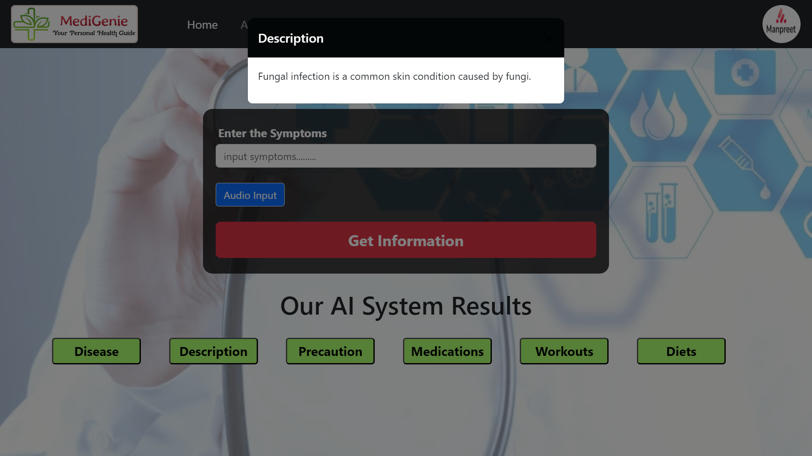

### Precation
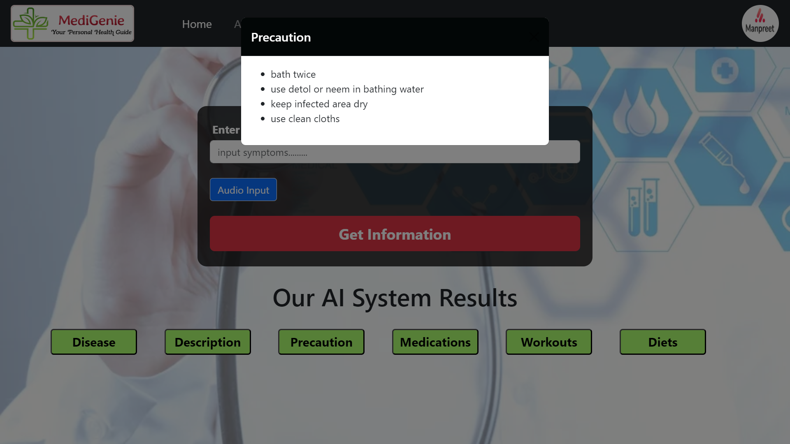

### Medications
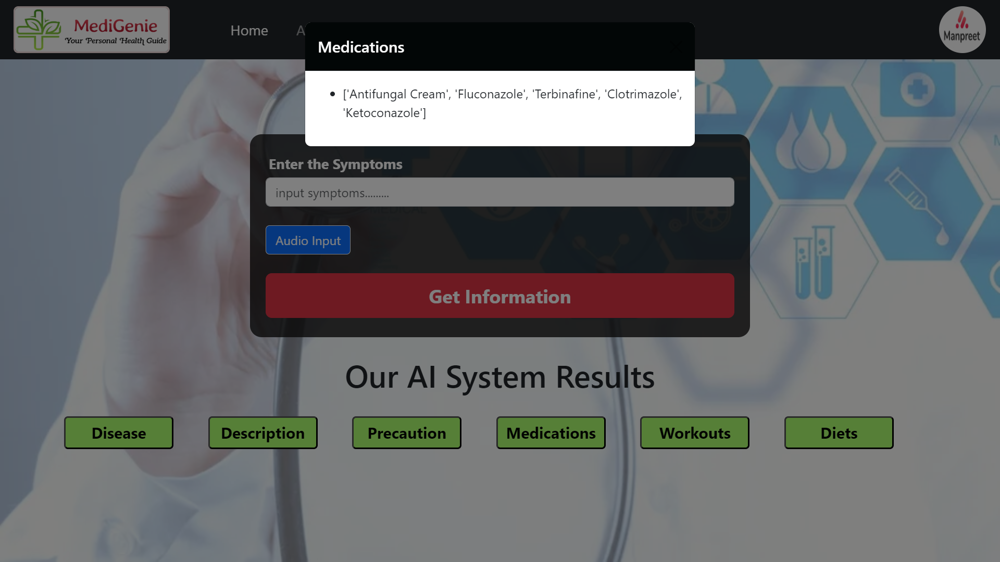

### Workouts
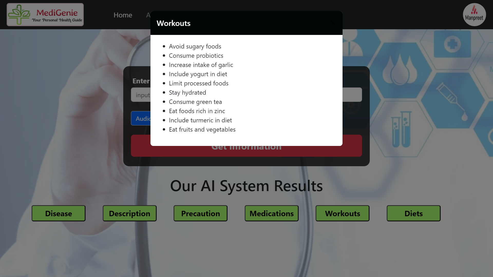

### Diets
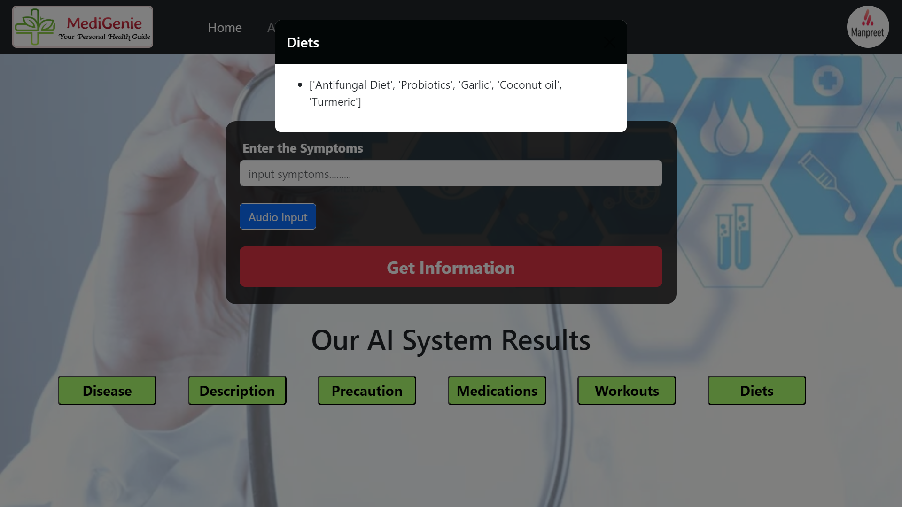

### About Me Page
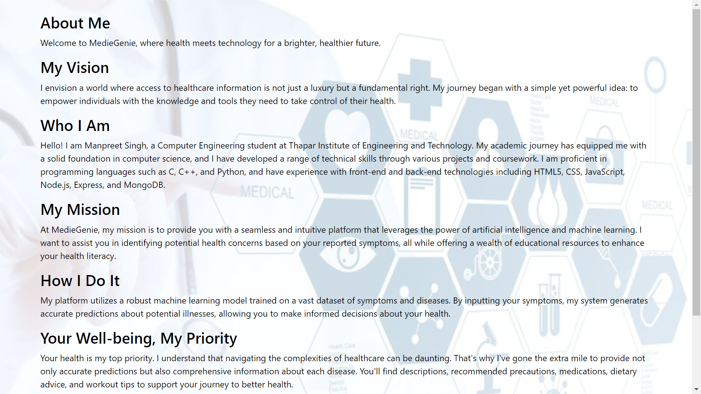

### Contact Me Page
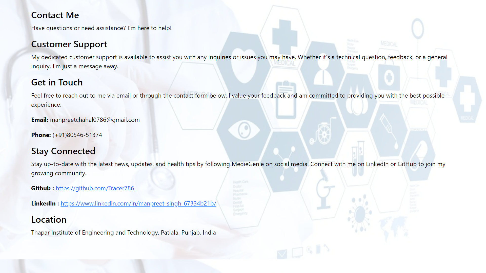

### Developer Page
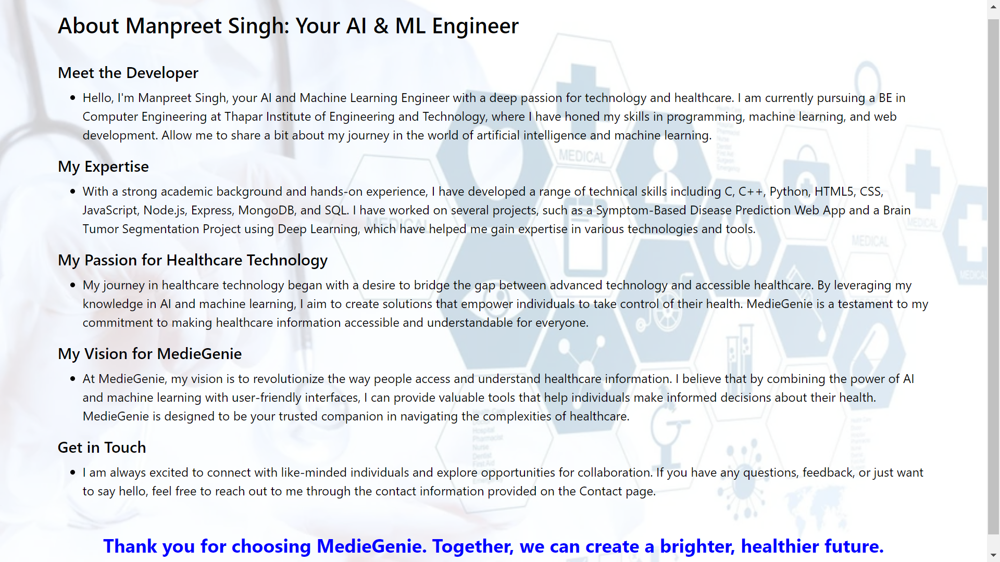

### Blog Page
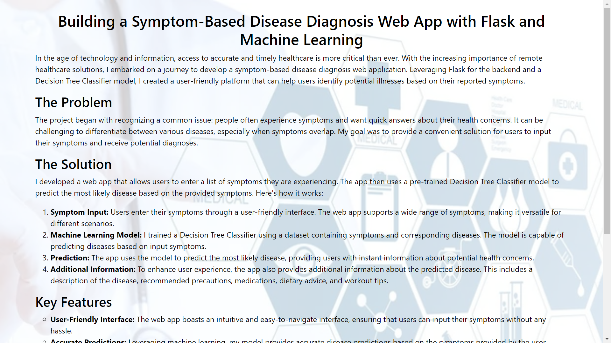